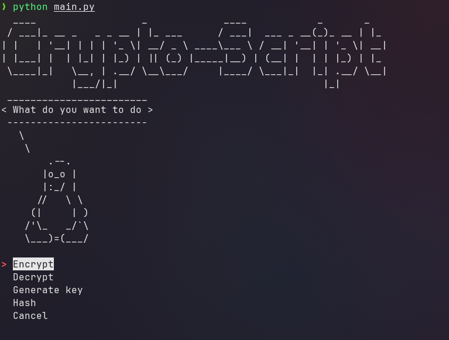

#  crypto-script

A terminal-based Python script for performing encryption operations using the `openssl` command-line tool. The interface relies on `figlet` and `cowsay` for output formatting, and `simple-term-menu` for interactive selection.

---

## Installation (Linux)

### 1. Clone the Repository

```bash
git clone https://github.com/RStephanH/crypto-script.git
cd crypto-script
````

### 2. Install `uv` (a fast alternative to pip & venv)

```bash
curl -LsSf https://astral.sh/uv/install.sh | sh
```

### 3. Create and Activate the Virtual Environment

```bash
uv venv --python 3.11 .venv
source .venv/bin/activate
```

### 4. Install Python Dependencies

```bash
uv pip install -r requirements.txt
```

### 5. Install Required System Packages

These utilities are **essential** for displaying the script's output:

#### Debian/Ubuntu:

```bash
sudo apt install figlet cowsay
```

#### Arch Linux:

```bash
sudo pacman -S figlet cowsay
```

---

##  Usage

Once all dependencies are installed, run the script from the project root:

```bash
uv run main.py
```

---

##  Preview



---

